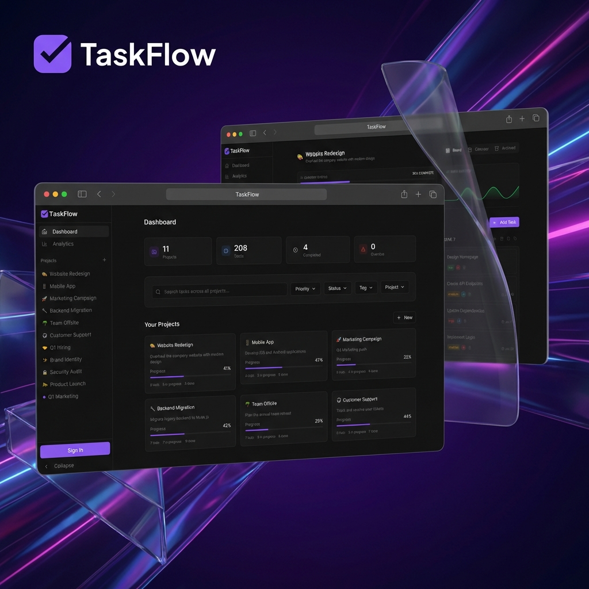
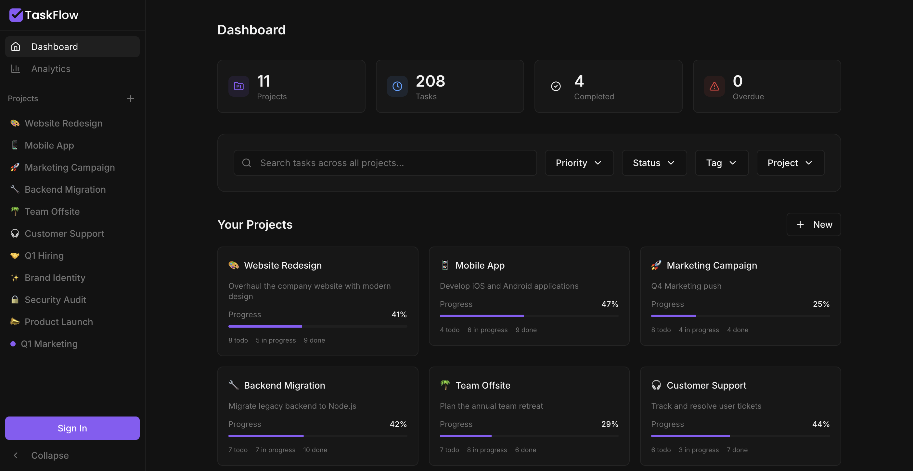
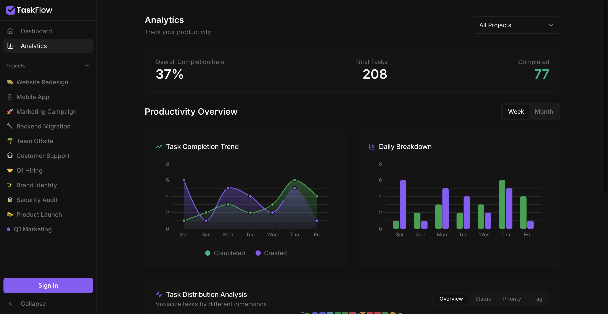
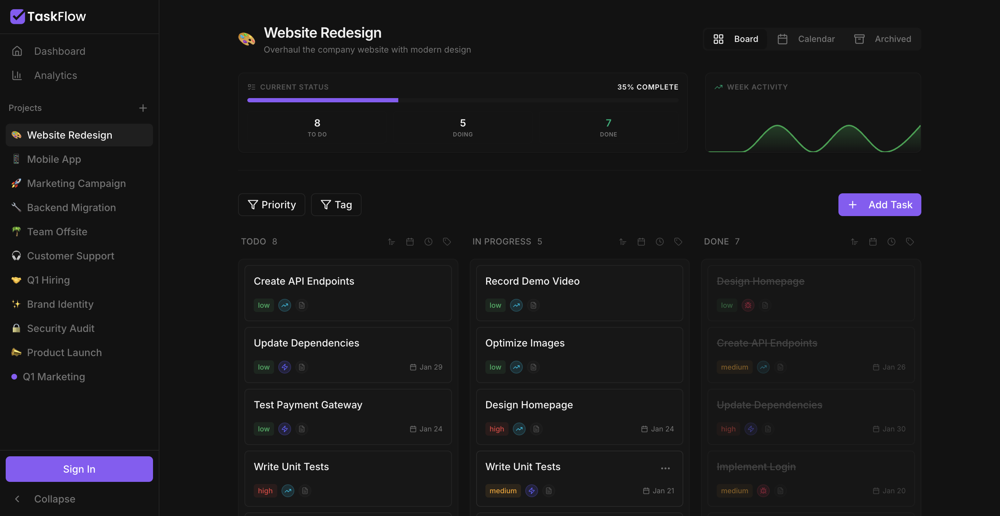
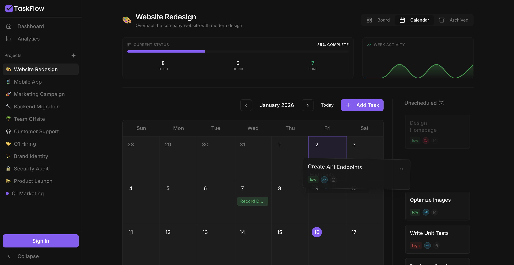

# TaskFlow

A sleek, modern, and highly functional task and project management application built with React, Vite, and Shadcn UI. This tool helps you organize your projects, track tasks with multiple views, and monitor your productivity with advanced data visualizations.

## ✨ Key Features

- **Project Management**: Create, edit, and categorize projects with custom icons (using the integrated emoji picker) and unique color-coded themes.
- **Dynamic Task Views**:
  - **Kanban Board**: Drag-and-drop task management across 'To Do', 'In Progress', and 'Done' columns.
  - **Interactive Calendar**: Visualize deadlines and schedules in a beautiful month-view calendar.
  - **Archive Management**: Clean up your workspace by archiving completed tasks, with the ability to view and restore them at any time.
- **Advanced Productivity Analytics**:
  - **Comprehensive Dashboard**: Track your efficiency with real-time statistics.
  - **Enhanced Visualizations**: Interactive Area, Bar, and Bubble charts detailing task completion trends. Focus on specific projects or view an all-project overview.
- **Smart Features**:
  - **Global Task Search**: Instantly find any task across all projects using a powerful search interface.
  - **Task Portability**: Export your projects to JSON and import them back, making it easy to backup or move your workflow.
  - **Smart Automation**: Automatically archives completed tasks once they are past their due date to keep your board clutter-free.
  - **Persistent Storage**: Robust data persistence using LocalStorage and Zustand.
- **Premium UI/UX**:
  - **Glassmorphism Design**: Modern, translucent interfaces with smooth transitions.
  - **Emoji Integration**: Choose from a wide range of emojis for project icons using `frimousse`.
  - **Responsive Layout**: Fully optimized for desktop and mobile experiences.
  - **Premium Landing Page**: A visually stunning introduction to the tool at the root url, with the main dashboard accessible at `/app`.

## 📸 Gallery

  
  

  
  

## � Tech Stack

- **Core**: [React 19](https://reactjs.org/) & [TypeScript](https://www.typescriptlang.org/)
- **Build Tool**: [Vite 7](https://vitejs.dev/)
- **Styling**: [Tailwind CSS 4](https://tailwindcss.com/)
- **Routing**: [React Router 7](https://reactrouter.com/)
- **State Management**: [Zustand](https://zustand.js.org/) with LocalStorage Persistence
- **UI Architecture**: [Shadcn UI](https://ui.shadcn.com/) (Radix UI Adaptations)
- **Data Visualization**: [D3.js](https://d3js.org/) for custom, high-performance charts
- **Async State**: [TanStack Query](https://tanstack.com/query/latest)
- **Utility Libraries**:
  - [date-fns](https://date-fns.org/) for precise time manipulation
  - [lucide-react](https://lucide.dev/) for high-quality iconography
  - [@dnd-kit](https://dnd-kit.com/) for fluid drag-and-drop interactions
  - [frimousse](https://github.com/vany08/frimousse) for a premium emoji picker experience

## 📝 License

This project is open-source and available under the MIT License.
