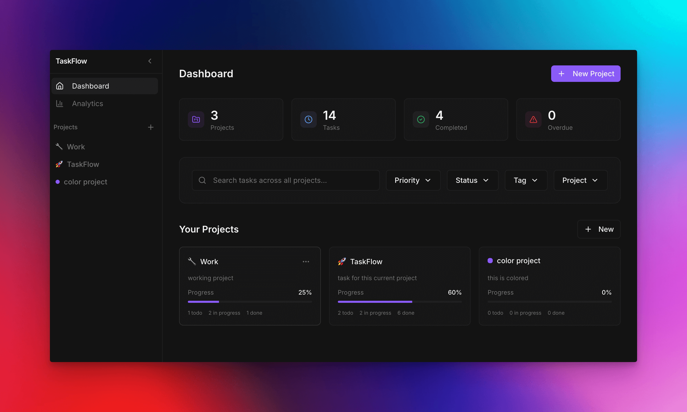

# TaskFlow

A sleek, modern, and highly functional task and project management application built with React, Vite, and Shadcn UI. This tool helps you organize your projects, track tasks with multiple views, and monitor your productivity with advanced data visualizations.

## ✨ Key Features

- **Project Management**: Create, edit, and categorize projects with custom icons and unique color-coded themes.
- **Dynamic Task Views**:
  - **Kanban Board**: Drag-and-drop task management across 'To Do', 'In Progress', and 'Done' columns.
  - **Interactive Calendar**: Visualize deadlines and schedules in a beautiful month-view calendar.
  - **Archive Management**: Clean up your workspace by archiving completed tasks, with the ability to view and restore them at any time.
- **Advanced Productivity Analytics**:
  - **Comprehensive Dashboard**: Track your efficiency with real-time statistics.
  - **Rich Visualizations**: Interactive Area, Bar, and Bubble charts detailing task completion trends, creation rates, and distribution analysis by status, priority, or tags.
- **Smart Features**:
  - **Global Task Search**: Instantly find any task across all projects using a powerful search interface.
  - **Smart Automation**: Automatically archives completed tasks once they are past their due date to keep your board clutter-free.
  - **Persistent Storage**: Robust data persistence using LocalStorage, ensuring your workflow remains uninterrupted.
- **Premium UI/UX**:
  - **Glassmorphism Design**: Modern, translucent interfaces with smooth transitions.
  - **Responsive Layout**: Fully optimized for desktop and mobile experiences.

## 🚀 Tech Stack

- **Core**: [React 18](https://reactjs.org/) & [TypeScript](https://www.typescriptlang.org/)
- **Build Tool**: [Vite](https://vitejs.dev/)
- **Styling**: [Tailwind CSS](https://tailwindcss.com/) with Custom Design Tokens
- **Routing**: [React Router](https://reactrouter.com/)
- **State Management**: Custom React Hooks with LocalStorage Persistence
- **UI Architecture**: [Shadcn UI](https://ui.shadcn.com/) (Radix UI Adaptations)
- **Data Visualization**: [D3.js](https://d3js.org/) for custom, high-performance charts
- **Async State**: [TanStack Query](https://tanstack.com/query/latest)
- **Utility Libraries**:
  - [date-fns](https://date-fns.org/) for precise time manipulation
  - [lucide-react](https://lucide.dev/) for high-quality iconography
  - [@dnd-kit](https://dnd-kit.com/) for fluid drag-and-drop interactions

## 📝 License

This project is open-source and available under the MIT License.
